# Summary of 2_DecisionTree

[<< Go back](../README.md)

## Decision Tree
- **n_jobs**: -1
- **criterion**: gini
- **max_depth**: 3
- **explain_level**: 2

## Validation
 - **validation_type**: split
 - **train_ratio**: 0.75
 - **shuffle**: True
 - **stratify**: True

## Optimized metric
logloss

## Training time

15.3 seconds

## Metric details
|           |    score |   threshold |
|:----------|---------:|------------:|
| logloss   | 0.382028 | nan         |
| auc       | 0.896185 | nan         |
| f1        | 0.8659   |   0.48443   |
| accuracy  | 0.847826 |   0.48443   |
| precision | 1        |   0.921986  |
| recall    | 1        |   0.0421875 |
| mcc       | 0.691641 |   0.48443   |

## Metric details with threshold from accuracy metric
|           |    score |   threshold |
|:----------|---------:|------------:|
| logloss   | 0.382028 |   nan       |
| auc       | 0.896185 |   nan       |
| f1        | 0.8659   |     0.48443 |
| accuracy  | 0.847826 |     0.48443 |
| precision | 0.843284 |     0.48443 |
| recall    | 0.889764 |     0.48443 |
| mcc       | 0.691641 |     0.48443 |

## Confusion matrix (at threshold=0.48443)
|              |   Predicted as 0 |   Predicted as 1 |
|:-------------|-----------------:|-----------------:|
| Labeled as 0 |               82 |               21 |
| Labeled as 1 |               14 |              113 |

## Learning curves
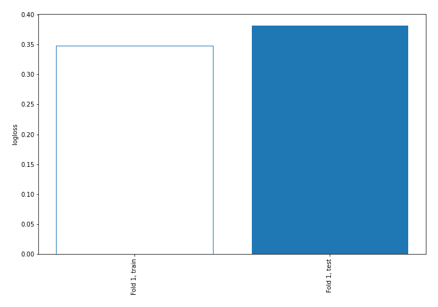

## Permutation-based Importance
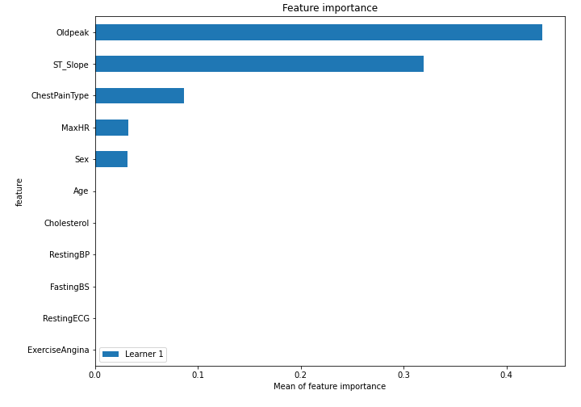
## Confusion Matrix

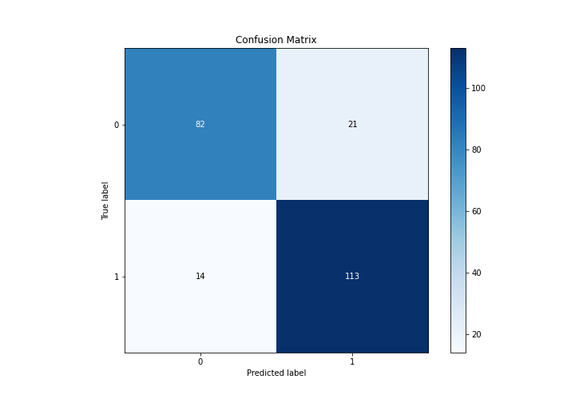

## Normalized Confusion Matrix

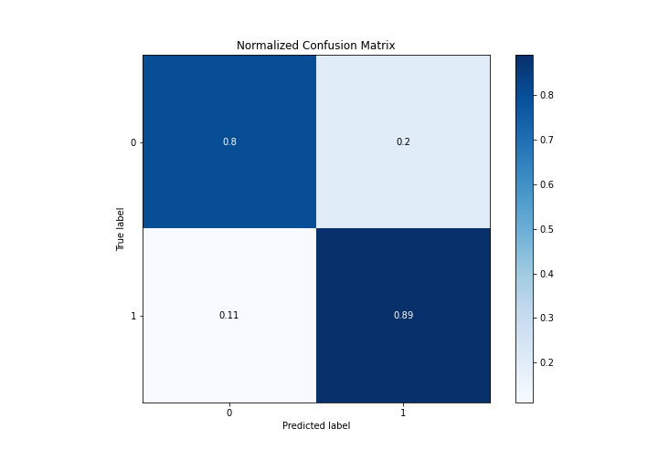

## ROC Curve

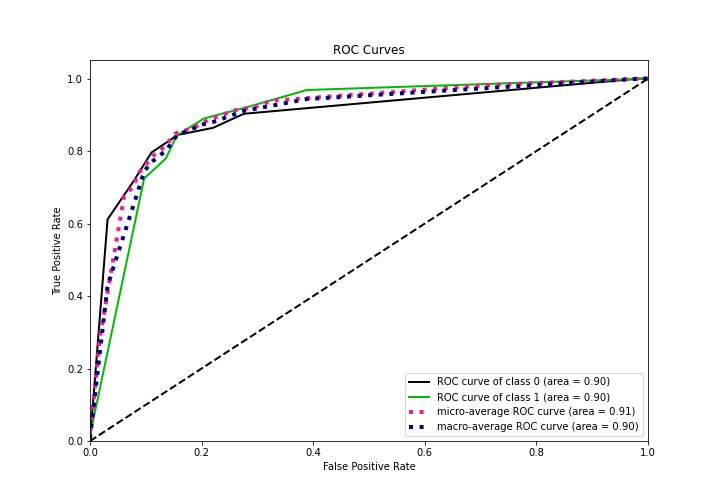

## Kolmogorov-Smirnov Statistic

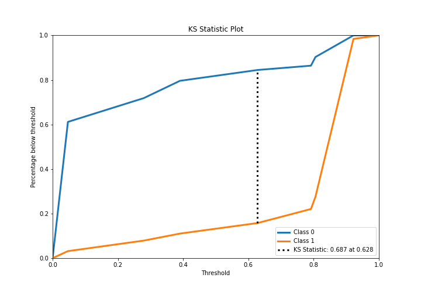

## Precision-Recall Curve

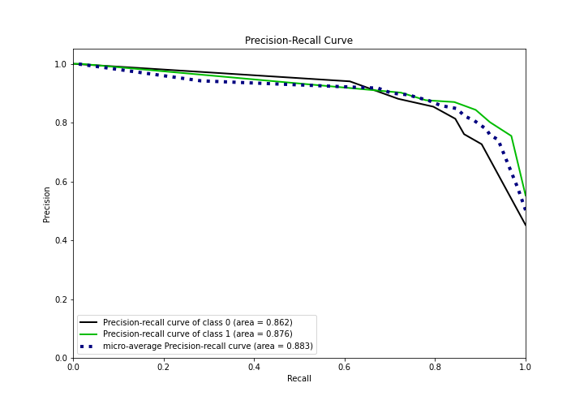

## Calibration Curve

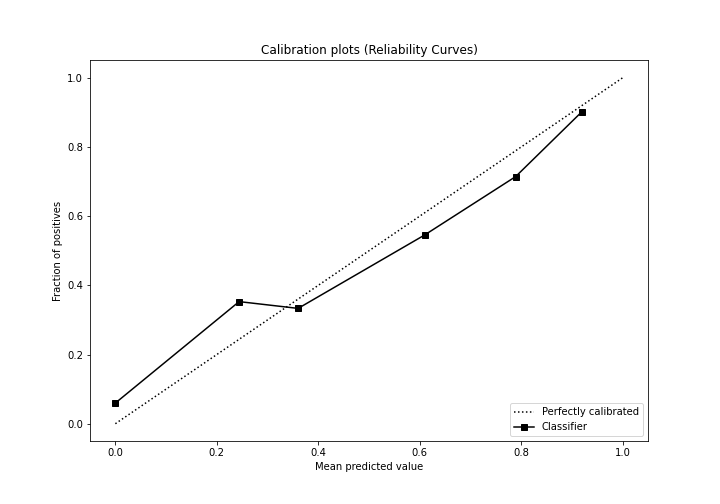

## Cumulative Gains Curve

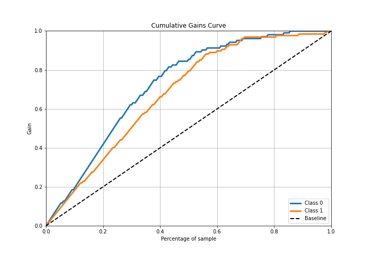

## Lift Curve

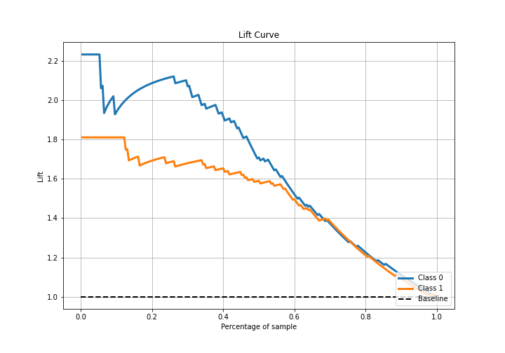

## SHAP Importance
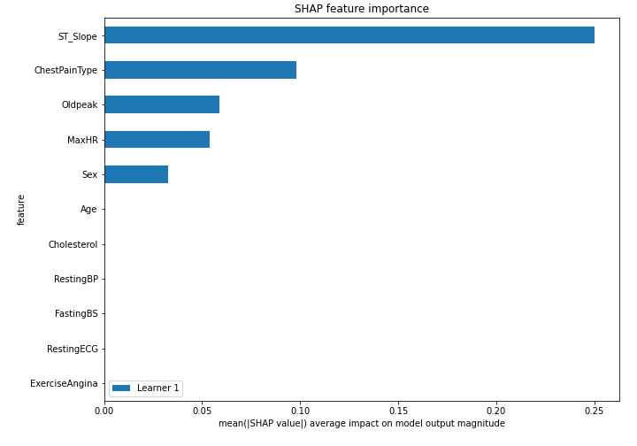

[<< Go back](../README.md)
