# Summary of 3_Linear

[<< Go back](../README.md)

## Logistic Regression (Linear)
- **n_jobs**: -1
- **explain_level**: 2

## Validation
 - **validation_type**: split
 - **train_ratio**: 0.75
 - **shuffle**: True
 - **stratify**: True

## Optimized metric
logloss

## Training time

1.3 seconds

## Metric details
|           |    score |   threshold |
|:----------|---------:|------------:|
| logloss   | 0.366499 | nan         |
| auc       | 0.915221 | nan         |
| f1        | 0.885375 |   0.553749  |
| accuracy  | 0.873913 |   0.553749  |
| precision | 0.952381 |   0.955134  |
| recall    | 1        |   0.0131203 |
| mcc       | 0.745312 |   0.553749  |

## Metric details with threshold from accuracy metric
|           |    score |   threshold |
|:----------|---------:|------------:|
| logloss   | 0.366499 |  nan        |
| auc       | 0.915221 |  nan        |
| f1        | 0.885375 |    0.553749 |
| accuracy  | 0.873913 |    0.553749 |
| precision | 0.888889 |    0.553749 |
| recall    | 0.88189  |    0.553749 |
| mcc       | 0.745312 |    0.553749 |

## Confusion matrix (at threshold=0.553749)
|              |   Predicted as 0 |   Predicted as 1 |
|:-------------|-----------------:|-----------------:|
| Labeled as 0 |               89 |               14 |
| Labeled as 1 |               15 |              112 |

## Learning curves
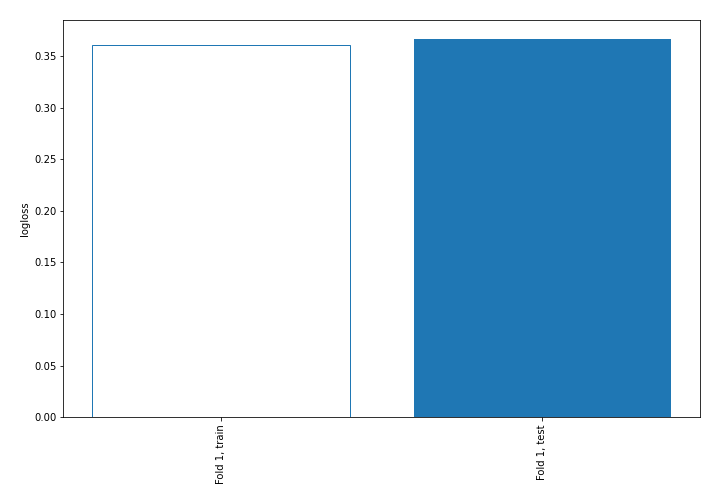

## Coefficients
| feature        |   Learner_1 |
|:---------------|------------:|
| FastingBS      |   1.13524   |
| ExerciseAngina |   0.577615  |
| Sex            |   0.504287  |
| Oldpeak        |   0.394973  |
| intercept      |   0.179786  |
| Age            |   0.149597  |
| RestingBP      |   0.0378569 |
| RestingECG     |  -0.10608   |
| MaxHR          |  -0.277033  |
| Cholesterol    |  -0.368433  |
| ChestPainType  |  -0.613226  |
| ST_Slope       |  -1.04187   |

## Permutation-based Importance
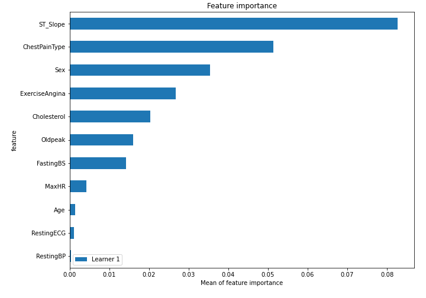
## Confusion Matrix

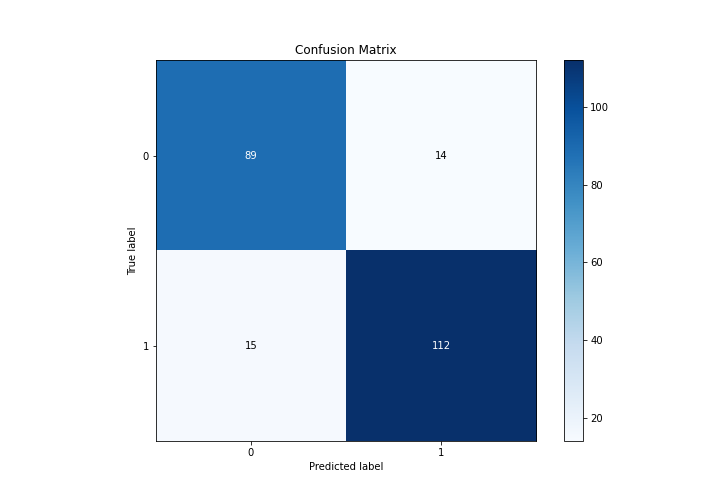

## Normalized Confusion Matrix

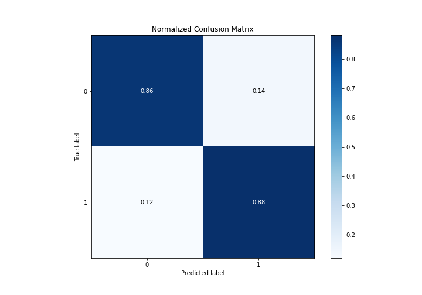

## ROC Curve

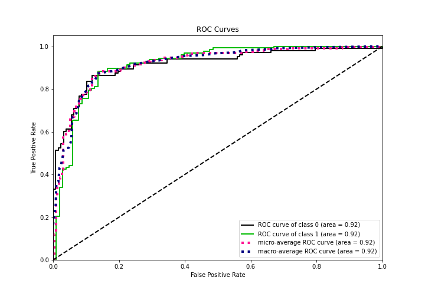

## Kolmogorov-Smirnov Statistic

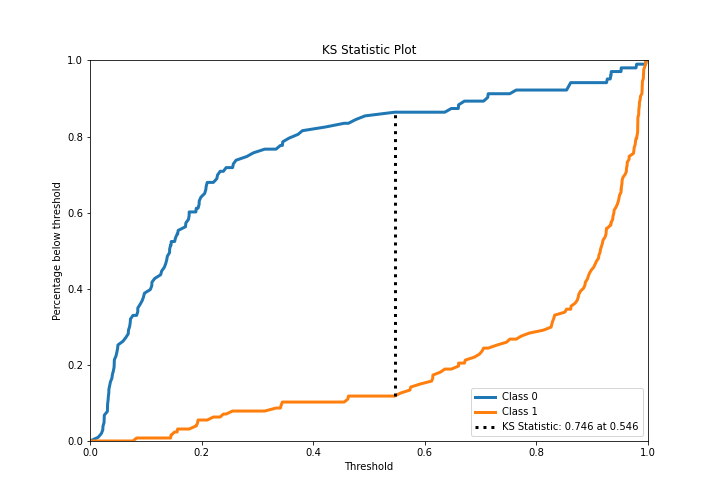

## Precision-Recall Curve

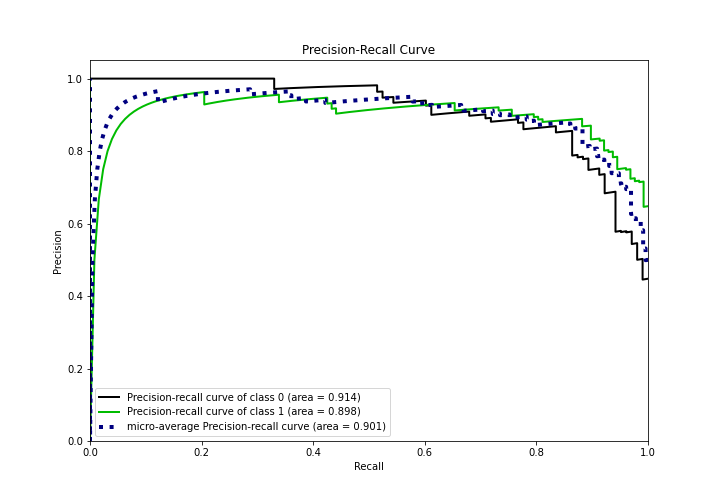

## Calibration Curve

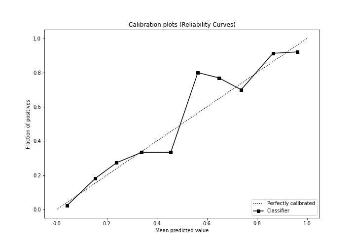

## Cumulative Gains Curve

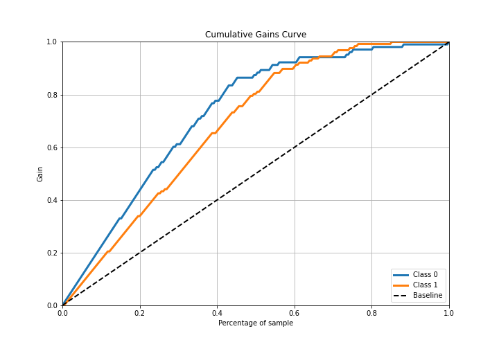

## Lift Curve

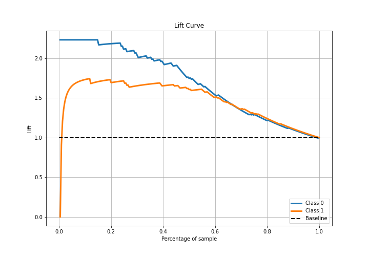

## SHAP Importance
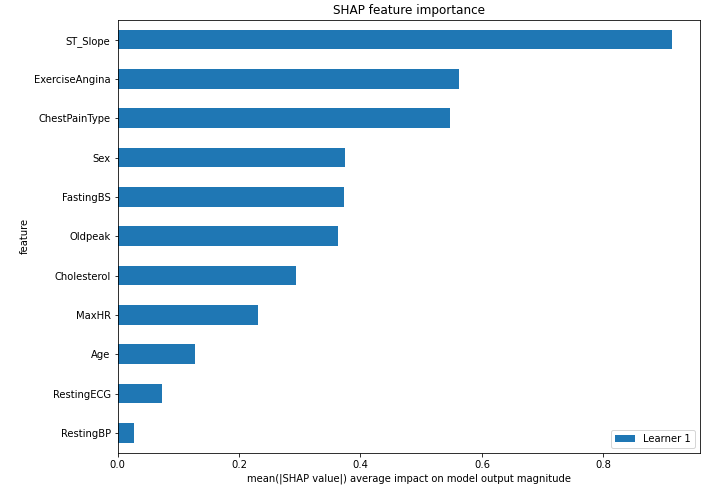

[<< Go back](../README.md)
