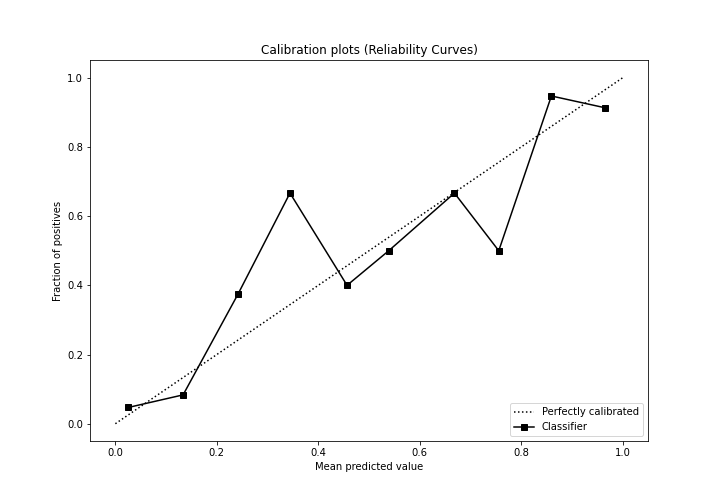

# Summary of 4_Default_Xgboost

[<< Go back](../README.md)

## Extreme Gradient Boosting (Xgboost)
- **n_jobs**: -1
- **objective**: binary:logistic
- **eta**: 0.075
- **max_depth**: 6
- **min_child_weight**: 1
- **subsample**: 1.0
- **colsample_bytree**: 1.0
- **eval_metric**: logloss
- **explain_level**: 2

## Validation
 - **validation_type**: split
 - **train_ratio**: 0.75
 - **shuffle**: True
 - **stratify**: True

## Optimized metric
logloss

## Training time

2.2 seconds

## Metric details
|           |    score |   threshold |
|:----------|---------:|------------:|
| logloss   | 0.346662 | nan         |
| auc       | 0.920419 | nan         |
| f1        | 0.881226 |   0.495373  |
| accuracy  | 0.865217 |   0.495373  |
| precision | 1        |   0.982311  |
| recall    | 1        |   0.0114109 |
| mcc       | 0.727102 |   0.495373  |

## Metric details with threshold from accuracy metric
|           |    score |   threshold |
|:----------|---------:|------------:|
| logloss   | 0.346662 |  nan        |
| auc       | 0.920419 |  nan        |
| f1        | 0.881226 |    0.495373 |
| accuracy  | 0.865217 |    0.495373 |
| precision | 0.858209 |    0.495373 |
| recall    | 0.905512 |    0.495373 |
| mcc       | 0.727102 |    0.495373 |

## Confusion matrix (at threshold=0.495373)
|              |   Predicted as 0 |   Predicted as 1 |
|:-------------|-----------------:|-----------------:|
| Labeled as 0 |               84 |               19 |
| Labeled as 1 |               12 |              115 |

## Learning curves

## Permutation-based Importance

## Confusion Matrix

## Normalized Confusion Matrix

## ROC Curve

## Kolmogorov-Smirnov Statistic

## Precision-Recall Curve

## Calibration Curve

## Cumulative Gains Curve

## Lift Curve

## SHAP Importance

[<< Go back](../README.md)
